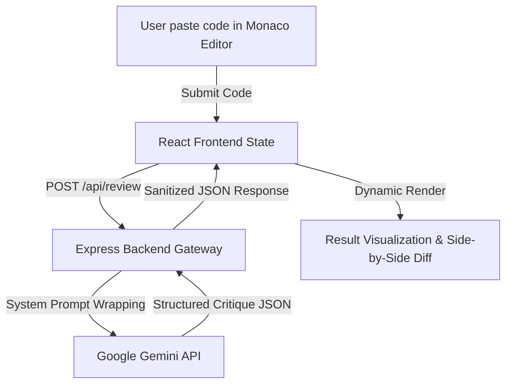

# 🔍 AI Code Reviewer

A web-based, real-time AI Code Reviewer designed to help developers optimize their code for efficiency, readability, and performance. This tool bridges the gap between getting an "Accepted" status (syntax/logical correctness) and writing clean, production-ready, industry-standard code.

---

## 💡 Motivation & Background

As developers, we often solve hundreds of algorithmic challenges on platforms like LeetCode or HackerRank. However, getting an **"Accepted"** submission only proves that the code is logically correct for the given test cases. It does not guarantee that:
* The code is clean, readable, or modular.
* The time and space complexities are optimal.
* It follows enterprise design patterns and industry best practices.

**AI Code Reviewer** was built to provide the instant, actionable feedback of a senior engineer. Instead of just syntax checking, the system evaluates code design, analyzes time complexity, and explains *why* specific optimizations are necessary.

---

## ⚡ Key Features

*   **Interactive Monaco Editor:** Integrated the VS Code editor engine directly into the web interface, providing developers with familiar keybindings, auto-completion, bracket matching, and multi-language syntax highlighting.
*   **Deep Complexity Analysis:** Highlights time and space complexities (Big O notation) of the submitted code and proposes optimized alternatives.
*   **Structured Review Cards:** Actionable feedback divided into three distinct categories:
    *   🔴 **Bugs & Edge Cases:** Identifies potential runtime errors, memory leaks, or unhandled inputs.
    *   🟡 **Readability & Style:** Suggests variable renaming, modularization, and adherence to clean code rules.
    *   🟢 **Optimization & Efficiency:** Provides refactored snippets with mathematical or algorithmic enhancements.
*   **Side-by-Side Code Diff:** Compares user-submitted code with AI-optimized code in real-time.
*   **Intuitive Landing Page:** A modern, distraction-free landing workspace with preloaded templates for quick testing.

---

## 🛠️ Tech Stack & Architecture

### Frontend
*   **React (SPA):** Powering the dynamic UI, workspace state, and real-time review updates.
*   **Monaco Editor (`@monaco-editor/react`):** Embedded code editor for rich developer experience.
*   **Tailwind CSS / Custom CSS:** Sleek developer-focused dark mode interface with clean animations.

### Backend & AI
*   **Google Gemini API:** Leveraging advanced LLM capabilities for code understanding and contextual critique.
*   **Node.js & Express:** Lightweight API server handling token limits, prompt templating, and secure requests.



---

## 🧠 Deep Engineering Challenges & Solutions

### 1. Monaco Editor in the React Lifecycle
**Challenge:** React re-renders components frequently on state changes, which can cause the Monaco Editor to lose focus, cursor position, or rebuild the entire DOM tree, causing noticeable lag.
**Solution:** 
* Utilized `@monaco-editor/react` with persistent reference hooks (`useRef`) to store the editor instance.
* Prevented re-renders by using uncontrolled components and managing the editor value directly via Monaco's internal model instead of mapping React state directly to the editor's raw input events.
* Handled language model binding dynamically to switch between JavaScript, Python, C++, and Java without re-instantiating the editor canvas.

### 2. Gemini API System Prompt Engineering
**Challenge:** Standard AI completions often return free-form conversational text, markdown blocks, or complete code replacements without detailed explanations, which makes it hard to parse and display structured feedback in a custom UI.
**Solution:**
* Engineered a strict system prompt instructing Gemini to return a structured JSON schema.
* Instructed the model to identify specific lines, categorize suggestions (Bug/Readability/Optimization), show the "before" and "after" code blocks, and calculate complexity metrics.
* Implemented backend parser validation to handle edge cases where the API output might contain markdown wrapper text (like ```json ... ```) or invalid JSON.

---

## 🚀 Setup & Installation

Follow these steps to run the project locally.

### Prerequisites
*   Node.js (v16.x or higher)
*   npm or yarn
*   A Gemini API Key (obtain from [Google AI Studio](https://aistudio.google.com/))

### 1. Backend Setup
1. Clone the repository and navigate to the backend folder:
   ```bash
   git clone https://github.com/kunalmore373/Academic_Outlier.git
   cd Hackathon/Backend
   ```
2. Install dependencies:
   ```bash
   npm install
   ```
3. Create a `.env` file in the `Backend` directory:
   ```env
   PORT=5000
   GEMINI_API_KEY=your_gemini_api_key_here
   ```
4. Start the backend development server:
   ```bash
   npm run dev
   ```

### 2. Frontend Setup
1. Open a new terminal and navigate to the frontend directory:
   ```bash
   cd Hackathon/frontend
   ```
2. Install dependencies:
   ```bash
   npm install
   ```
3. Create a `.env` file in the `frontend` directory:
   ```env
   VITE_API_URL=http://localhost:5000/api
   ```
4. Start the Vite React development server:
   ```bash
   npm run dev
   ```
5. Open your browser and go to `http://localhost:5173`.

---

## 🔮 Future Enhancements

*   **VS Code Extension:** Pack the reviewer logic into a VS Code extension for inline code review directly inside the IDE.
*   **Multilingual Explanation Support:** Explain complex algorithms in simple diagrams or multi-step breakdown tutorials.
*   **Historical Dashboard:** Allow developers to log in (via OAuth) to save their reviews and track improvement history over time.
*   **Custom Prompting:** Allow users to choose their reviewer profile (e.g., "Strict Tech Lead", "Patient Mentor", "Performance Optimizer").

---

Developed with ❤️ by [Kunal More](https://github.com/kunalmore373)
